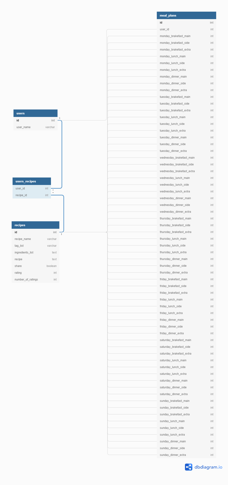

# Full Stack Cookbook Personal Project
 
This project is to test my learning and create a full stack web app. The idea behind the app is a personalised cookbook that lets you use a recipe API to find new recipes that you can save to your cookbook. Potentially with the ability to have multiple users as well as adding your own customised recipes.
 
intended API has not panned out, with lake of a decent replacement this concept has been removed. Current concept is to allow saving of a custom recipe with an option to share it for searches that will have more content as the db grows. Now loosing a large part of the functionality the concept will now include a stretch goal of allowing a user to create a meal plan for a week and get a combined list of increadiants as a shoping list starter.

KanBan board located at: https://trello.com/b/u3wr31Wm/cookbook-planner
DB schema located at: https://dbdiagram.io/d/5ea5427e39d18f5553fe388d 
 
# learning objectives

- [ ] full stack integrated
- [ ] DB created
- [ ] API linked and called on
- [ ] react single page webapp front end
- [ ] clean and professional use of CSS
- [ ] basic authentication
- [ ] profile based personalisation 
- [ ] full test suite
- [ ] deployed to heroku
 
# Technology used
 
For this project I plan to use the full range of technology and techniques such as redux, react, express, API's, relational database, and a full test suite as well as the expected languages for these technologies such as javascript, JSX, SQL, HTML and CSS.
 
# MVP use stories
 
- [ ] As a user I want to be able to search for a recipe
- [ ] As a user I want to be able to save a recipe I have found to my own personal cook book
- [ ] As a user I want to be able to add a custom recipe to my cookbook 
 
# stretch goals

- [ ] As a user I want to be able to refine my search for a recipe
- [ ] As a user I want to be able to log into my profile that has a unique log in
- [ ] As a user I want to be able to change preferences on my unique account
- [ ] As a user I want to be able to make a meal plan for a week with the saved recipes in my cookbook
- [ ] As a user I want to be able to recive a shoping list starter with the combined ingredients from the meal plan
- [ ] As an admin I want to be able to limit the ability to share a recipe if IP concerns are raised
 

